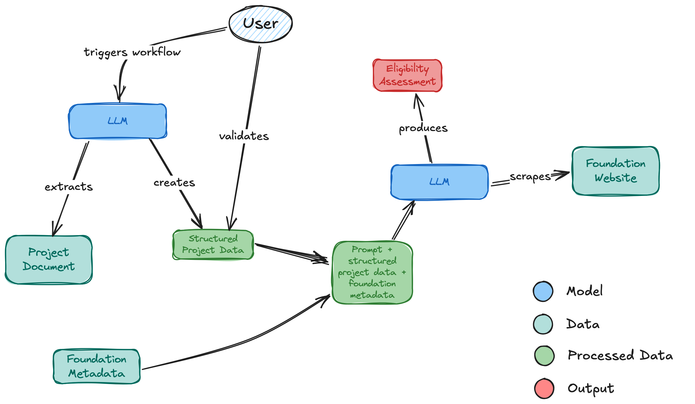

## Assignment description

The objective of this coding challenge is to have you implement an agent to judge whether a project meets the basic requirements of a specific foundation or grant in order to receive funding.

Projects can be submitted via file import or user input. The agent maintains a list of foundation/grant websites. The agent checks the contents of the websites and determines the eligibility based on the project description.
 
You are free to choose any model, framework, and programming language.

Please note:

    Finish the challenge within 2 - 3 hours.
    Code structure should be clear and readable.
    The output can be reproduced and verified.

In the attachment, please find an example of the project description and a list of the grant websites.

## Architecture

## Improvements

- Have more robust handling of outputs (currently there are many places with raw text being parsed)
- Parallelize foundation assessment
- Have a loop in the project extraction phase that interacts with the user to refine the structured project details (instead of just trying again)
- Store the results of the structured project details in a database after this interaction (structured data with reference to full text in a different document database, for example)
- More comprehensive web scraping of the foundations (downloading documents to access more details, follow links that require multiple clicks)
- Store structured data of the web scraping of foundations to use later (this work can be done offline, since criteria don't change that often)
- Store past data of foundations (how many grants were given, amount, to whom)
- Test individual components of the flow
- Add support for different models to have a fallback if one provider is down
- Evaluate the prompts, trying to reduce the size to reduce the number of tokens used
- Change input/output formats to integrate with other systems